# Dungeon Crawler Team RL

This branch turns the old arena experiment into a fixed-layout cooperative dungeon campaign. A five-agent team starts from a known spawn, climbs through ten handcrafted floors, opens chests for persistent power-ups, defeats minibosses on floor 5 and floor 10, and learns route quality rather than surviving on random map luck.

The Python package name is still `behavior_mutation_arena` for continuity, but the active project on `dungeon-crawler-training` is a dungeon crawler training stack.

## Why this redesign exists

The arena version was too noisy to learn from consistently:

- terrain changed too often
- reward spikes were dominated by luck
- survival could beat meaningful progression
- policies were not getting repeated practice on the same tactical problems

This branch replaces that setup with static floors, fixed starts, deterministic objectives, and reusable power-up routes so policies can improve generation over generation.

## Campaign loop

- Team size: `5`
- Grid size: `36x36`
- Floors: `10`
- Episode length: `650` steps
- Spawn: fixed team formation at the start of every floor
- Progression: reach the gate to move up a floor
- Boss cadence: miniboss on floor `5`, final boss on floor `10`
- Goal: learn the best chest path, combat pacing, and boss-clear route that leads to a full clear

## Floor gallery

The dungeon is intentionally static so policies can repeatedly practice the same route, risk, and power-up decisions. The floor images below are exported from the same fixed floor definitions used by training.

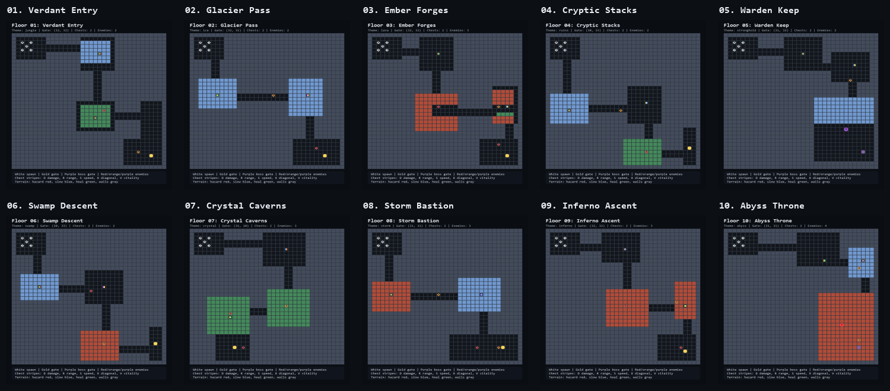

| Floor 1 | Floor 2 |
|---|---|
| 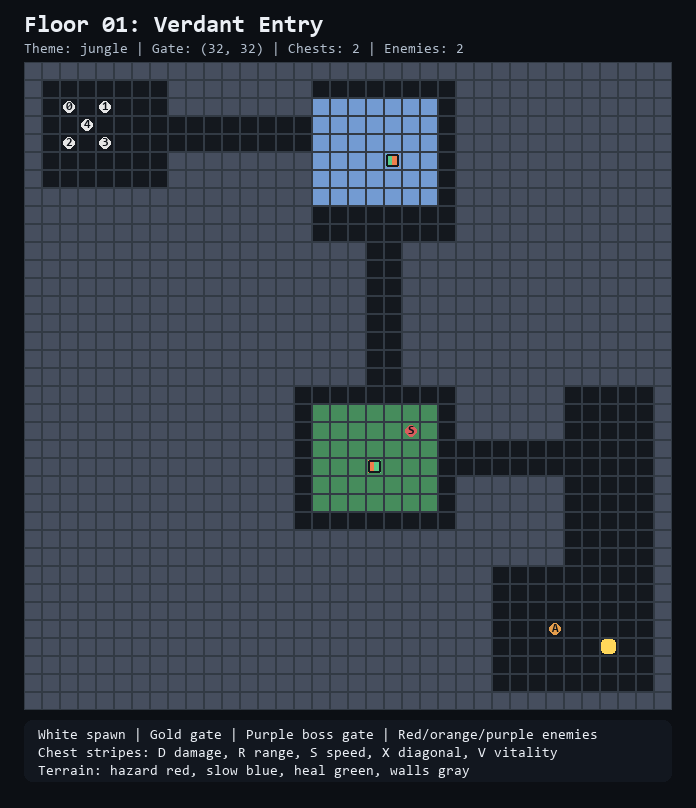 | 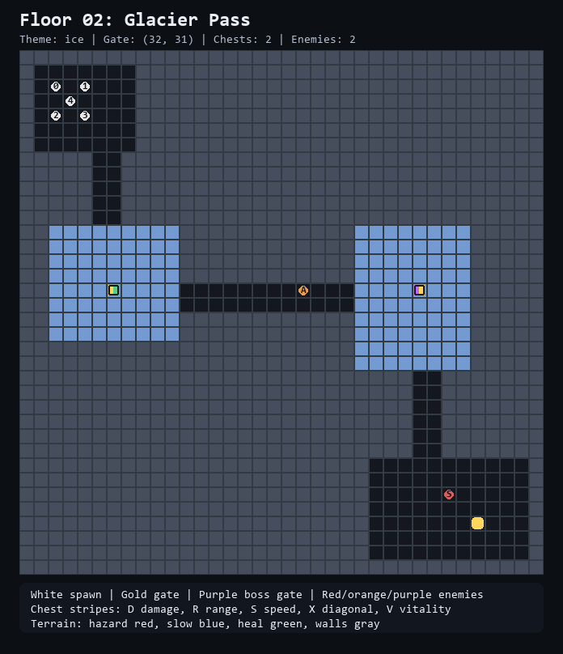 |

| Floor 3 | Floor 4 |
|---|---|
| 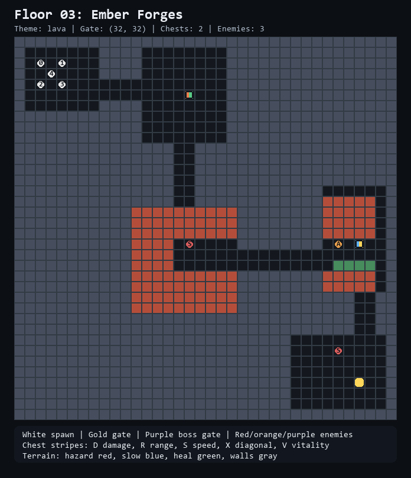 | 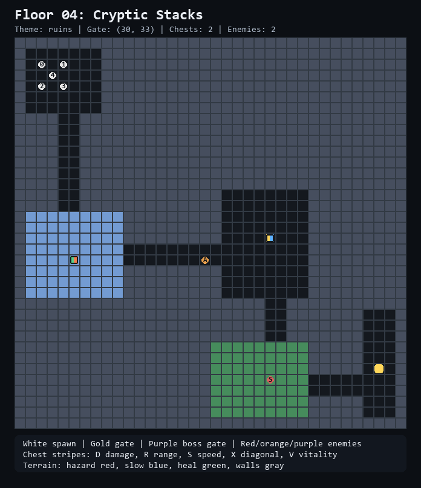 |

| Floor 5 | Floor 6 |
|---|---|
| 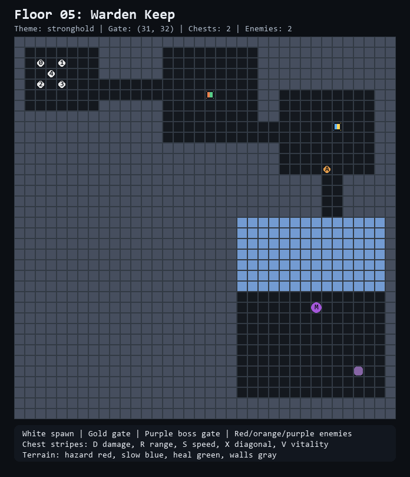 | 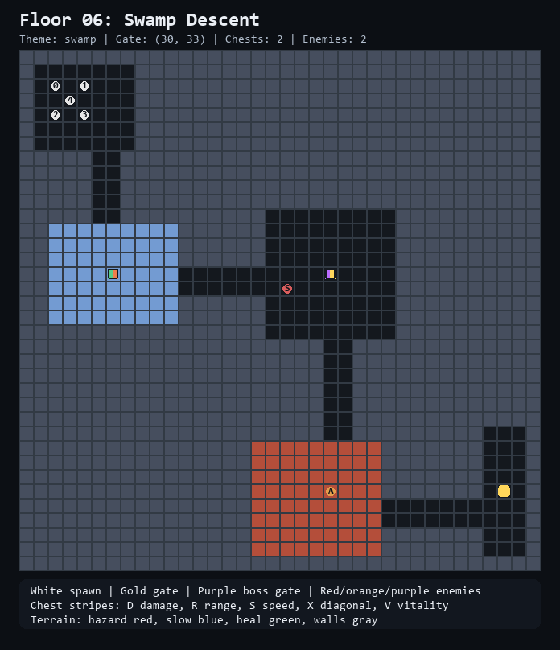 |

| Floor 7 | Floor 8 |
|---|---|
| 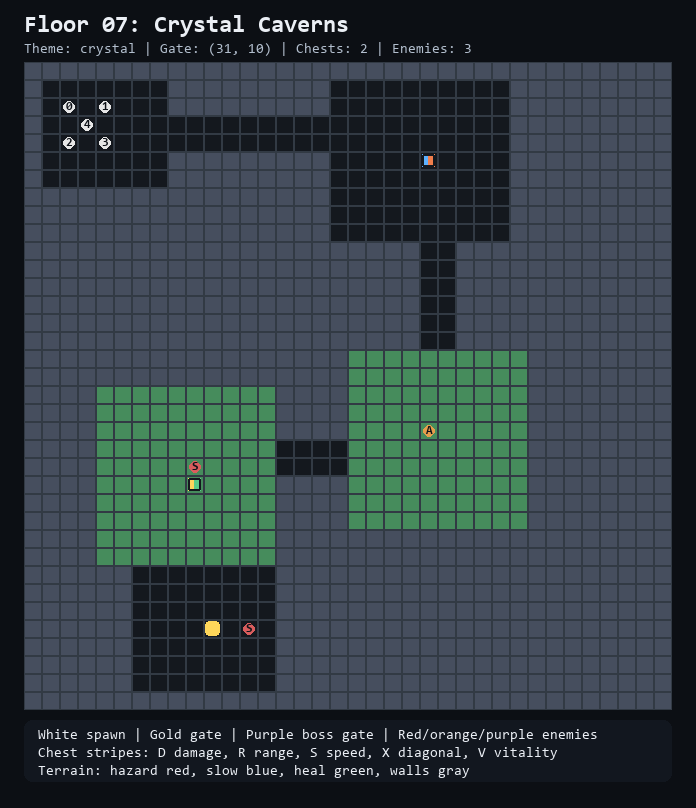 | 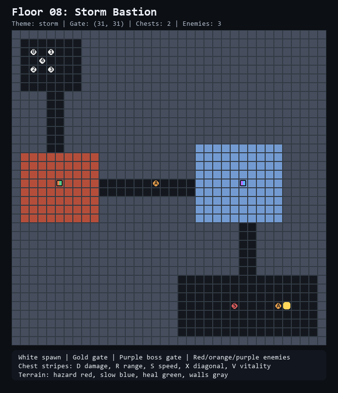 |

| Floor 9 | Floor 10 |
|---|---|
| 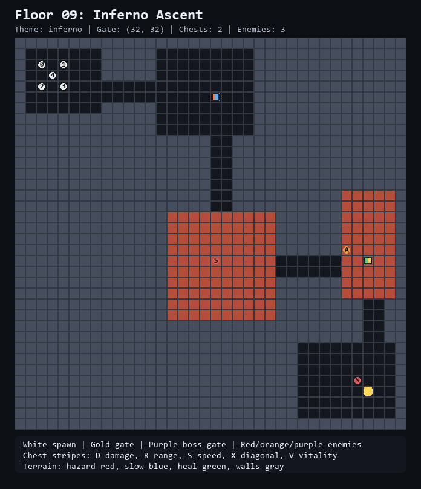 | 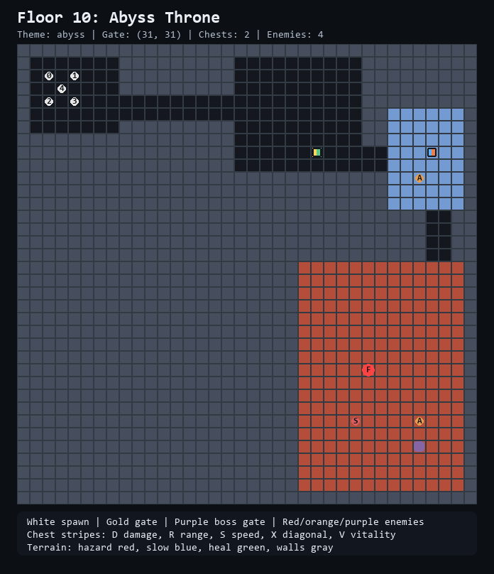 |

Each floor uses a different biome and tactical pressure:

- `Verdant Entry`: jungle opener with healing and early core buffs
- `Glacier Pass`: ice floor with slow regions and mobility upgrades
- `Ember Forges`: lava floor with hazard routing and damage pressure
- `Cryptic Stacks`: ruins with library-style chokepoints and heal pockets
- `Warden Keep`: first boss floor, gate locked behind a miniboss
- `Swamp Descent`: attrition floor with slows and hazards
- `Crystal Caverns`: dual-heal routing and split-lane decisions
- `Storm Bastion`: high-pressure mid-late floor
- `Inferno Ascent`: late-game hazard floor before the throne
- `Abyss Throne`: final boss floor designed to be beatable only if the team arrives with the right upgrades and enough health

## Power-ups and progression

Chests now hold multiple first-come rewards. The agent that opens a reward receives that power-up and its immediate reward, which creates an actual team-allocation problem: one agent can become a carry, or rewards can be spread across the squad for survivability.

- `Damage`: higher attack damage
- `Range`: longer attack reach
- `Speed`: extra movement per step
- `Diagonal`: unlocks diagonal movement
- `Vitality`: raises effective max health and heals the receiving agent

This makes route planning trainable. A policy can skip a chest, fail later, and eventually learn that the earlier detour was necessary for a later boss or floor.

## Reward design

The reward signal is now shaped around campaign progress instead of passive survival:

- small per-step cost to avoid wasting turns
- reward for claiming chest power-ups
- small penalty for standing on hazard tiles
- reward for damage dealt
- stronger rewards for reaching gates and clearing floors
- large reward for defeating minibosses and the final boss
- victory reward for finishing the full dungeon
- penalties for death and full team wipes

Fitness also tracks strategic progress:

- floors cleared
- bosses defeated
- chests opened
- damage dealt
- survival contribution
- final victory bonus

## Project structure

```text
behavior_mutation_arena/
  config.py
  core/
    dungeon_floors.py
    environment.py
    models.py
    replay.py
  rl/
    buffer.py
    policy.py
    ppo.py
  evolution/
    engine.py
  interface/
    api.py
    backend.py
  visual/
    plots.py
    renderer.py
docs/
  architecture.md
native/
  CMakeLists.txt
  README.md
  src/
    bindings.cpp
scripts/
  evaluate_checkpoint.py
  export_floor_maps.py
  plot_metrics.py
  replay_best.py
  train.py
static/
  floors/
    all_floors_contact_sheet.png
    floor_01_verdant_entry.png
    ...
artifacts/
  checkpoints/
  plots/
  replays/
```

## Main modules

- `core.dungeon_floors`: deterministic floor geometry, chest placement, enemy placement, gate positions
- `core.environment.ArenaEnvironment`: team simulation, movement, combat, buffs, floor transitions, observations, rewards
- `rl.policy.ActorCriticPolicy`: actor-critic network used by each team member policy
- `rl.ppo.PPOPolicyBank`: rollout action selection and PPO updates for the current population
- `evolution.engine.EvolutionEngine`: elite selection and Gaussian mutation between generations
- `interface.api.ArenaSimulation`: generation loop, checkpointing, plots, and replay capture
- `visual.renderer.ArenaRenderer`: live dungeon rendering
- `visual.plots`: training metric plotting for floor progress, bosses, chests, and success rate

## Install

```powershell
python -m pip install -e .
```

## Train

Run a fresh training session:

```powershell
python scripts/train.py --generations 50 --name quick_v3_test
```

Run multiple dungeon instances per generation so PPO and evolution score the same team across more than one rollout:

```powershell
python scripts/train.py --generations 50 --instances 32 --name 32v3_seed7
```

Resume from the latest checkpoint:

```powershell
python scripts/train.py --generations 200 --name 32v3_seed7
```

Render the run live:

```powershell
python scripts/train.py --generations 20 --render
```

Render a tiled multi-instance window while simulating more instances than you draw:

```powershell
python scripts/train.py --generations 20 --instances 32 --render --render-instances 20
```

Checkpointing happens every `10` generations by default, so `Ctrl+C` still leaves you with restartable progress.

Training history is protected. If an existing run has `metrics.csv`, `--scratch` refuses to overwrite it. Use a new `--name` for new experiments.

Safety caps are built in:

- at most `128` simulated instances per run
- at most `100` rendered instances per run
- the default training setup now uses `32` simulated instances with `16` worker threads
- if `--render-instances` is omitted, the renderer defaults to `20` so the window stays readable while all requested instances still simulate

Recommended v3 runs:

```powershell
python scripts/train.py --generations 10000 --instances 32 --seed 7 --name 32v3_seed7 --checkpoint-interval 5

python scripts/train.py --generations 10000 --instances 32 --seed 42 --name 32v3_seed42 --checkpoint-interval 5
```

## Parallel execution notes

- The current trainer batches policy inference across all live instances, which helps both CPU and GPU utilization.
- Environment stepping is parallelized with a `ThreadPoolExecutor`, which is a good fit for the numpy-heavy parts of the environment without paying Windows process-spawn startup cost on every run.
- On Windows, true multiprocessing uses `spawn`, not `fork`, so worker startup has a one-time import cost.
- If we later move the environment shard workers into a persistent `ProcessPoolExecutor` or dedicated worker processes, that should unlock more CPU scaling than threads for the pure-Python parts of stepping.

## Evaluate and inspect

Evaluate the saved best policy:

```powershell
python scripts/evaluate_checkpoint.py --episodes 5
```

Replay the best recorded run:

```powershell
python scripts/replay_best.py
```

Rebuild training plots from the CSV log:

```powershell
python scripts/plot_metrics.py
```

Export the floor images used in this README:

```powershell
python scripts/export_floor_maps.py --out static/floors
```

## Metrics written to artifacts

- `artifacts/checkpoints/best_policy.pt`
- `artifacts/checkpoints/training_state.pt`
- `artifacts/replays/best_replay.pkl`
- `artifacts/metrics.csv`
- `artifacts/plots/training_metrics.png`

## Current backend direction

The simulation still runs in Python first, but the boundary for a native backend is preserved through `interface.backend.build_backend()`. That lets us keep PPO and evolution in Python while moving hot environment loops to C++ with pybind11 later.

## Parallelization path

- Run many training jobs in parallel at the process level today for hyperparameter sweeps.
- Move hot loops in `core.environment` into a pybind11 backend once rollout throughput becomes the bottleneck.
- Batch policy inference by population, or shard population members across vectorized arenas.
- Keep PPO in Python and only expose `reset`, `step`, `observe`, and `snapshot` from the native backend.
